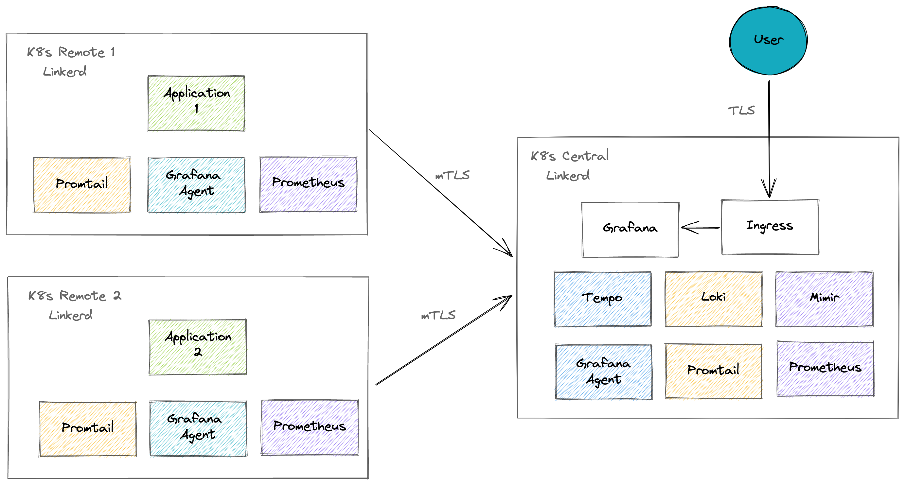
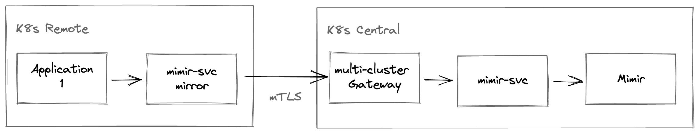

## KinD: Linkerd + Grafana LGTM Stack (Loki-Grafana-Tempo-Mimir) multi-cluster LAB


### Requirements

- Linux OS
- [Docker](https://docs.docker.com/)
- [KinD](https://kind.sigs.k8s.io/)
- [kubectl](https://kubernetes.io/docs/reference/kubectl/)
- [helm](https://helm.sh/docs/intro/install/)
- [Step CLI](https://smallstep.com/docs/step-cli)
- [linkerd](https://linkerd.io/2.13/getting-started/#step-1-install-the-cli)
- [linkerd-smi](https://linkerd.io/2.13/tasks/linkerd-smi/#cli)

```
### linkerd & linkerd-smi CLI install:
curl --proto '=https' --tlsv1.2 -sSfL https://run.linkerd.io/install | sh
curl -sL https://linkerd.github.io/linkerd-smi/install | sh
export PATH=$PATH:/home/davar/.linkerd2/bin
```


### Setup k8s clusters


Run the `setup-clusters.sh` script. It creates three KinD clusters:

- One primary cluster (`lgtm-central`)
- One remote (`lgtm-remote``)

`kubectl` contexts are named respectively:

- `kind-lgtm-central`
- `kind-lgtm-remote`

```
Example Output:

./setup-clusters.sh 
[+] Creating KinD clusters
   ⠿ [lgtm-central] Cluster created
   ⠿ [lgtm-remote] Cluster created
[+] Adding routes to other clusters
   ⠿ [lgtm-central] Route to 10.20.0.0/24 added
   ⠿ [lgtm-remote] Route to 10.10.0.0/24 added
[+] Deploying MetalLB inside clusters
   ⠿ [lgtm-central] MetalLB deployed
   ⠿ [lgtm-remote] MetalLB deployed
```

Setup Linkerd
```

### Create anchor and issuer certificates for Linkerd:

./deploy-certs.sh 
Your certificate has been saved in ca.crt.
Your private key has been saved in ca.key.
Your certificate has been saved in issuer-central.crt.
Your private key has been saved in issuer-central.key.
Your certificate has been saved in issuer-remote.crt.
Your private key has been saved in issuer-remote.key.

for ctx in kind-lgtm-central; do                   
  echo "install crd ${ctx}"
  lk install --context=${ctx} --crds | ka - --context=${ctx};

  echo "install linkerd ${ctx}";
  lk install --context=${ctx} \
    --identity-trust-anchors-file=ca.crt \
    --identity-issuer-certificate-file=issuer-central.crt \
    --identity-issuer-key-file=issuer-central.key | ka - --context=${ctx};

  echo "install viz ${ctx}";
  lk --context=${ctx} viz install | ka - --context=${ctx};

  echo "install multicluster ${ctx}";    
  lk --context=${ctx} multicluster install | ka - --context=${ctx};

  echo "install smi ${ctx}";        
  lk smi install --context=${ctx}  | ka - --context=${ctx};
done


for ctx in kind-lgtm-remote; do                   
  echo "install crd ${ctx}"
  lk install --context=${ctx} --crds | ka - --context=${ctx};

  echo "install linkerd ${ctx}";
  lk install --context=${ctx} \
    --identity-trust-anchors-file=ca.crt \
    --identity-issuer-certificate-file=issuer-remote.crt \
    --identity-issuer-key-file=issuer-remote.key | ka - --context=${ctx};

  echo "install viz ${ctx}";
  lk --context=${ctx} viz install | ka - --context=${ctx};

  echo "install multicluster ${ctx}";    
  lk --context=${ctx} multicluster install | ka - --context=${ctx};

  echo "install smi ${ctx}";        
  lk smi install --context=${ctx}  | ka - --context=${ctx};
done


for ctx in kind-lgtm-central kind-lgtm-remote; do
  printf "Checking cluster: ${ctx} ........."
  while [ "$(kubectl --context=${ctx} -n linkerd-multicluster get service linkerd-gateway -o 'custom-columns=:.status.loadBalancer.ingress[0].ip' --no-headers)" = "<none>" ]; do
      printf '.'
      sleep 1
  done
  echo "`kubectl --context=${ctx} -n linkerd-multicluster get service linkerd-gateway -o 'custom-columns=:.status.loadBalancer.ingress[0].ip' --no-headers`"
  printf "\n"
done

for ctx in kind-lgtm-central kind-lgtm-remote; do
  echo "Checking link....${ctx}"
  lk --context=${ctx} multicluster check

  echo "Checking gateways ...${ctx}"
  lk --context=${ctx} multicluster gateways

  echo "..............done ${ctx}"
done
```

## Architecture



In the Kubernetes world, the best way to monitor the cluster and everything running on it are via Prometheus. Microservices, especially those written in Go, could expose metrics in Prometheus format, and there is a vast collection of exporters for those applications that don't natively. For that reason, Mimir is the best way to consolidate metrics from multiple Kubernetes clusters (and the applications running on each of them).

Loki is drastically easier to deploy and manage than the traditional ELK stack, which is why I consider it the best log aggregation solution. For similar reasons, Tempo for traces.


We will use Grafana Agent to send traces to Tempo on all environments to have multi-tenancy on traces, deployed as a `Deployment`.

We will use Promtail to send logs to Loki on all environments deployed as a `DaemonSet`.

We will use Prometheus to send metrics to Mimir on all environments.

We will have *two* Kubernetes clusters, one with the LGTM Stack exposing Grafana via Ingress (`central`), and another with a sample application, generating metrics, logs, and traces (`remote`).

As Zero Trust is becoming more important nowadays, we'll use [Linkerd](https://linkerd.io/) to secure the communication within each cluster and the communication between the clusters, which gives us the ability to have a secure channel without implementing authentication, authorization, and encryption on our own.



We will use Minikube for the clusters, and as the Linkerd Gateway for Multi-Cluster requires a Load Balancer service, we will enable and configure the MetalLB plugin on Minikube, and we'll have different Cluster Domain.

For MetalLB, the Central cluster will use segment `x.x.x.201-210`, and the Remote cluster will employ `x.x.x.211-220` for the Public IPs extracted from the Minikube IP on each case.

The Multi-Cluster Link is originated on the Remote Cluster, targeting the Central Cluster, meaning the Service Mirror Controller lives on the Remote Cluster.

Each remote cluster would be a Tenant in terms of Mimir, Tempo and Loki. For demo purposes, Grafana has Data Sources to get data from the Local components and Remote components.

Mimir supports Tenant Federation if you need to look at metrics from different tenants simultaneously.

### Data Sources

The following is the list of Data Sources on the Central Grafana:

* `Mimir Local` to get metrics from the local Mimir (long term). The default DS for Prometheus, can also be used, for short periods.
* `Tempo Local` to get traces from the local cluster.
* `Loki Local` to get logs from the local cluster.

* `Mimir Remote` to get metrics from the remote cluster.
* `Tempo Remote` to get traces from the remote cluster.
* `Loki Remote` to get logs from the remote cluster.


## Start

* Deploy Central Cluster with LGTM stack 

```bash
./deploy-central.sh
```

* Deploy Remote Cluster with sample application linked to the Central Cluster :

```bash
./deploy-remote.sh
```

## Validation

### Linkerd Multi-Cluster

The `linkerd` CLI can help to verify if the inter-cluster communication is working. From the `remote` cluster, you can do the following:

```bash
➜  kubectl config use-context kind-lgtm-remote
Switched to context "remote".
```

```bash
➜  linkerd mc check
linkerd-multicluster
--------------------
√ Link CRD exists
√ Link resources are valid
	* central
√ remote cluster access credentials are valid
	* central
√ clusters share trust anchors
	* central
√ service mirror controller has required permissions
	* central
√ service mirror controllers are running
	* central
√ all gateway mirrors are healthy
	* central
√ all mirror services have endpoints
√ all mirror services are part of a Link
√ multicluster extension proxies are healthy
√ multicluster extension proxies are up-to-date
√ multicluster extension proxies and cli versions match

Status check results are √
```

```bash
➜  linkerd mc gateways
CLUSTER       ALIVE    NUM_SVC      LATENCY
central  True           3          2ms
```

When linking `remote` to `central` via Linkerd Multi-Cluster, the CLI will use the Kubeconfig from the `central` to configure the service mirror controller on the `remote` cluster.

You can inspect the runtime kubeconfig as follows:

```bash
$ kubectl config use-context kind-lgtm-remote
$ kubectl get secret -n linkerd-multicluster cluster-credentials-lgtm-central -o jsonpath='{.data.kubeconfig}' | base64 -d; echo

kubectl get secret -n linkerd-multicluster cluster-credentials-central \
  -o jsonpath='{.data.kubeconfig}' | base64 -d; echo
```

To see the permissions associated with the `ServiceAccount` on the central cluster:

```bash
➜  kubectl describe clusterrole linkerd-service-mirror-remote-access-default --context kind-lgtm-central
Name:         linkerd-service-mirror-remote-access-default
Labels:       linkerd.io/extension=multicluster
Annotations:  linkerd.io/created-by: linkerd/cli stable-2.13-2
PolicyRule:
  Resources   Non-Resource URLs  Resource Names    Verbs
  ---------   -----------------  --------------    -----
  events      []                 []                [create patch]
  configmaps  []                 [linkerd-config]  [get]
  endpoints   []                 []                [list get watch]
  services    []                 []                [list get watch]
```

> Note that the `ServiceAccount` exists on both cluster.

In other words, to create a link from `remote` to `central`, we run the following assuming the current context is assigned to `remote`:
```bash
linkerd mc link --context kind-lgtm-central --cluster-name lgtm-central
```

With the `--context` parameter, we specify the "target" cluster and assign a name to it (which will be part of the exposed service names in the remote cluster). If we inspect the YAML file generated by the above command, we can see a secret that contains `kubeconfig`; that's how to reach the `central` cluster, and that will be taken from your local kubeconfig, but using a user called `linkerd-service-mirror-remote-access-default` (a service account in the `linkerd-multicluster` namespace that exists in both clusters).

Another service account called `linkerd-service-mirror-central` for the mirror service will be created.

So, the Linkerd Gateway runs in both clusters, but the Mirror Service runs in the remote cluster (where you created the link from).

### LGTM Stack

You should add an entry to `/etc/hosts` for `grafana.example.com` pointing to the IP that the Ingress will get on the Central cluster (the script will tell you that IP), or:

```
kubectl get svc --context kind-lgtm-central -n ingress-nginx ingress-nginx-controller \
  -o jsonpath='{.status.loadBalancer.ingress[0].ip}'; echo
```

Then, access the Grafana WebUI available at `https://grafana.example.com` and accept the warning as the site uses a certificate signed by a self-signed CA.

The password for the `admin` account is defined in [values-prometheus-central.yaml](./values-prometheus-central.yaml) (i.e., `Adm1nAdm1n`). From the Explore tab, you should be able to access the data collected locally and received from the remote location using the data sources described initially.

Within the [dashboards](./dashboards/) subdirectory, you should find some sample Mimir dashboards (the README under this folder explains how to generate them). More importantly, there is a dashboard for the TNS App that you can use to visualize metrics from more locations based on the metrics stored in the central location. If you check the logs for that application (`tns` namespace), you can visualize the remote logs stored on the central Loki and the traces.

## Clean local environment

```bash

$ kind delete cluster --name=lgtm-central
$ kind delete cluster --name=lgtm-remote
```

### Credits: 
https://github.com/agalue/LGTM-PoC
### Todo : Fix Linkerd, Tempo & Mimir 
